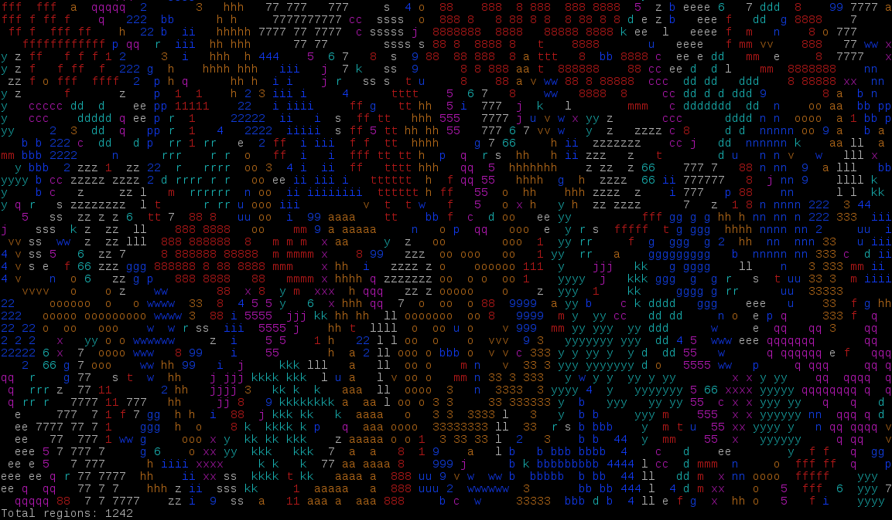

I had fun with this, not least adding in terminal colours to make it more easy to visually inspect regions.

I had a bug where I wasn't recursing to the left in my find region function (> instead of >=) and it made it much easier to spot:

